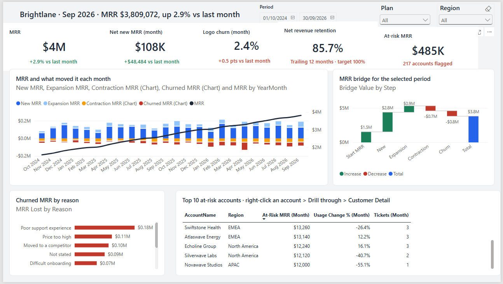
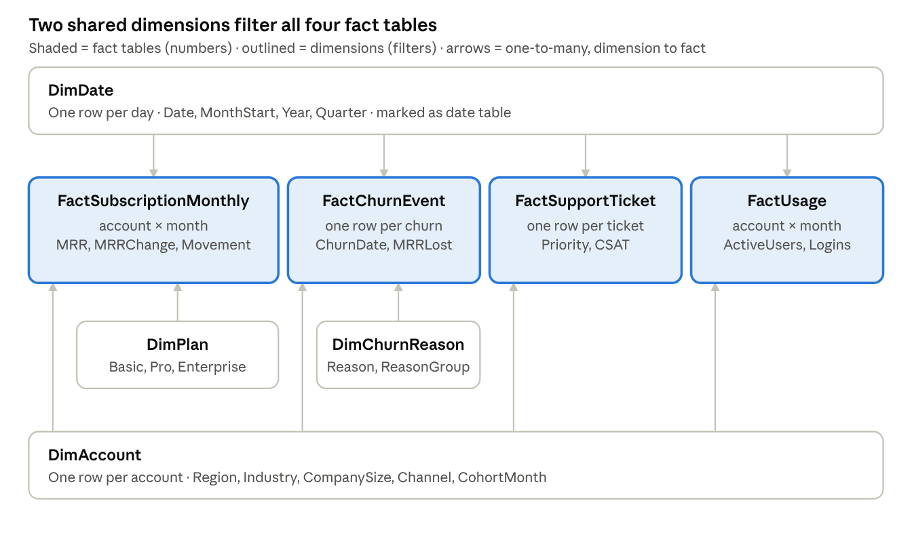

# Brightlane SaaS Churn: Executive Power BI Dashboard

A 3-page Power BI dashboard that shows the owners of a B2B SaaS company **how much recurring revenue they lose to churn, from whom, why, and which accounts to save next**, at a glance.



## Key findings

The full analysis and recommendations are in the [insights memo](docs/insights-memo.md).

- **Retention is the problem, not growth.** MRR reached $3.81M (+2.9% in September 2026), but 12-month net revenue retention is only **85.7%**.
- **Support is the #1 cause of lost revenue: 23% of churned MRR.** When resolution time more than doubled (8.4 to 19.3 hours) in Q1 2026, monthly churn rose to 3.3–3.9%.
- **The July 2025 Basic price rise backfired.** Basic churn jumped to **7.8%** that month.
- **$485K of MRR (12.7%) is at risk right now**, across 217 accounts flagged by falling usage or heavy ticket volume.

## Report pages

| Page | Answers | Highlights |
| --- | --- | --- |
| **Executive Overview** | Are we winning? | 5 KPI cards with month-on-month deltas · MRR trend with movements · MRR waterfall bridge · churn by reason · top 10 at-risk accounts |
| **Churn Drivers** | Who leaves, and why? | Metric switcher (field parameter) · churn by plan and region · cohort retention heatmap · decomposition tree · risk scatter |
| **Customer Detail** | What happened to this account? | Drill-through page: status, MRR and usage history, ticket log |
| *Tooltip* | What happened that month? | Custom report-page tooltip on the trend chart |

## Skills shown

| Area | What this project shows |
| --- | --- |
| **Data modeling and ETL** | Star schema (4 facts, 4 dimensions) · parameterised Power Query · 9 deliberate data-quality issues cleaned (duplicates, 12 region spellings, mixed date formats…) |
| **Advanced DAX** | 67 measures · snapshot vs. flow logic for MRR · NRR, cohort retention, LTV · time intelligence · rule-based at-risk scoring · waterfall bridge · dynamic titles and conditional colours |
| **UX and storytelling** | Executive layout · synced slicers · drill-through · report-page tooltip · field parameter · bookmarks · custom theme |
| **Governance** | Row-level security roles by region · Power BI Project (`.pbip`) format, so every model and report change is a readable Git diff |
| **Business insight** | KPI tree tied to owner goals · [insights memo](docs/insights-memo.md) with owned recommendations |

## Data model



`DimDate` and `DimAccount` filter all four fact tables. Every relationship is one-to-many and single-direction.
MRR is treated as a **snapshot**, taken at the latest month in the selection. New, Expansion, Contraction and Churned MRR are **flows**, summed over the period.

## Repository

```
data/raw/        7 generated CSV files (source data)
scripts/         generate_data.py: rebuilds the data (Python 3, standard library only)
powerquery/      one M script per table + the DataFolder parameter
dax/             measures.dax: the full, commented measure library
docs/            project plan, data dictionary, insights memo
report/          Brightlane.pbip (Power BI project) + theme JSON
```

## How to run

1. Open `report/Brightlane.pbip` in Power BI Desktop.
2. Go to **Transform data → Manage Parameters** and set `DataFolder` to your local `data\raw\` folder, ending in `\`.
3. Click **Refresh**.
4. *(Optional)* Regenerate the data with `python scripts/generate_data.py`. The seed is fixed, so the output is identical.

## Data note

All data is **synthetic**. It was generated to follow realistic SaaS patterns, and Brightlane and every account name are fictional.
See [docs/data-dictionary.md](docs/data-dictionary.md) for every table, column and known data-quality issue.
